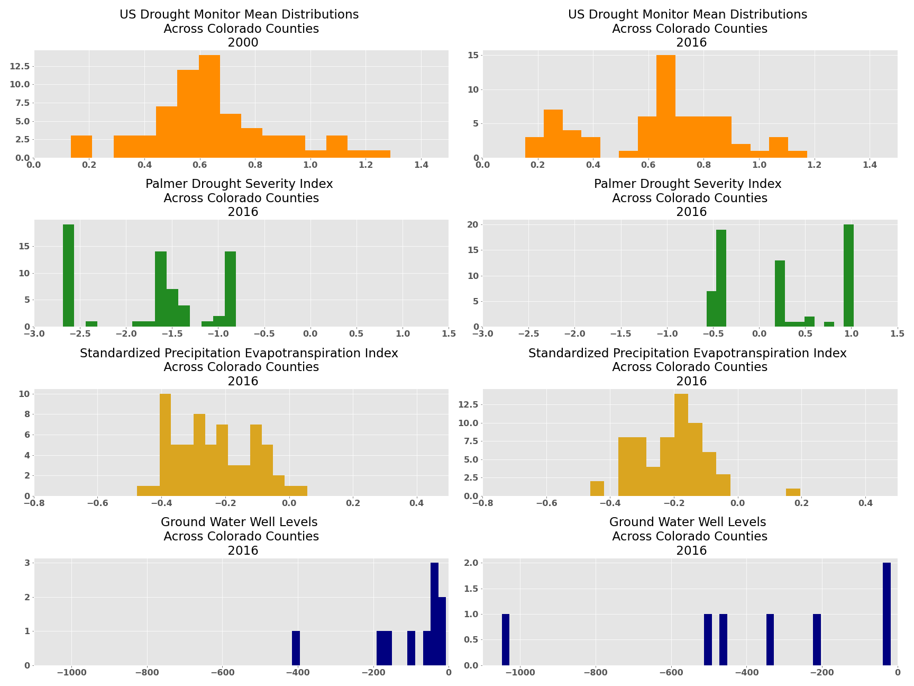
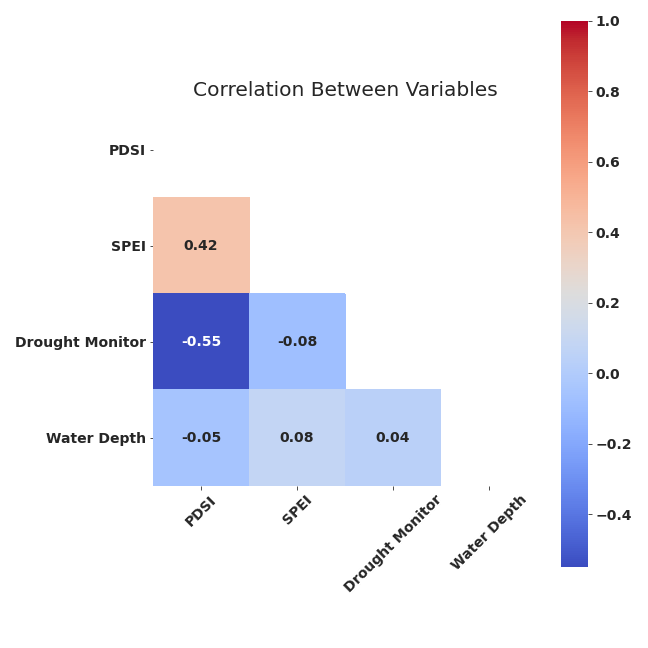
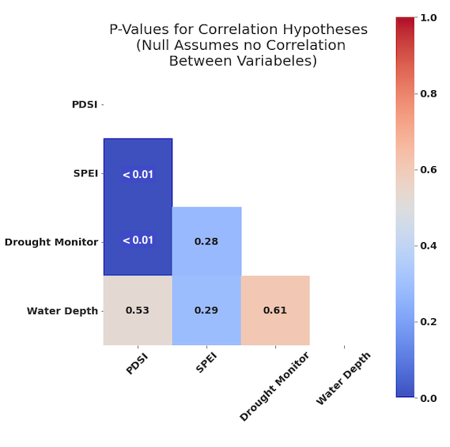
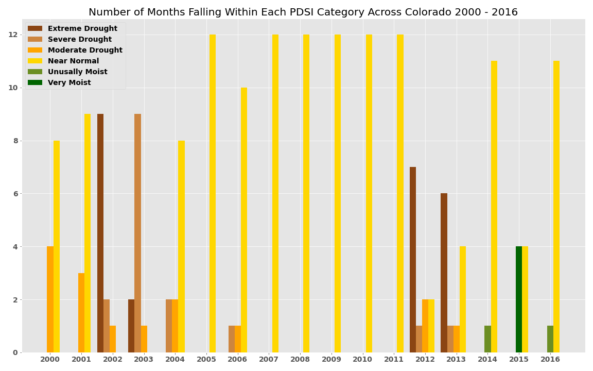

# A Study of Drought Trends in Colorado and Impact on Colorado Water Well Levels, 2000 - 2016
### *Galvanize DSI Capstone 1*
### *Alex Truby*

-------------

## Background and Motivating Questions 
The news cycle in the year of 2020 has been quite the wild ride. Living in Colorado, *just a few* of the topics of note have been drought and wildfire. Many residents here have been personally effected by both. As a Colorado resident, both of these events are particularly concerning. As a water engineer however, I am more intrigued about any trends we might be realzing in drought over the years, and what impact it might have on Colorado water resources. As such, the goal of this capstone project is to explore the following questions:

* **Has drought severity changed in Colorado between the years of 2000 and 2016?**
* **Have groundwater well depth levels changed between the years of 2000 and 2016?**
* **Are there any signifanct differences between the drought indicators chosen for this study?**
* **What relationship, if any, is there between drought severity and water level depths in ground water wells in Colorado over the last twnety years?**

The search for a drought data set quickly led to the realization that there are, in fact, a few different indicators out there to measure drought. The three indices utilized in this study are as follows:
*  **Palmer Drought Severity Index (PDSI) -** Maintained by the National Center for Atmospheric Research (NCAR)  and the University Coporation for Atmospheric Research (UCAR) in Boulder, the PDSI captures drought with a model  utilizing both termperature data and a physical water balance model. More information can be found [here](https://climatedataguide.ucar.edu/climate-data/palmer-drought-severity-index-pdsi).

| Drought Severity                | PDSI Range                            |
| ------------------------------- | ------------------------------------- |
| Extemely Drought                | -4.0 or less                          |
| Severe Drought                  | -3.0 to -3.9                          |
| Moderate Drought                | -2.0 tp -2.9                          |
| Near Normal                     | -1.9 to 1.9                           |
| Unusually Moist                 | 2.0 to 2.9                            |
| Very Moist                      | 3.0 to 3.9                            |
| Extremely Moist                 | 4.0 and above                         |

* **Standardized Precipitation Evapotranspiration Index (SPEI) -** The SPEI is an extension of the precipitaion index utilized in the PDSI model, but also includes potential surface water evapotranspiration. Because of this, the SPEI should also account for the impact on water demand from increased temperature (something ). More information can be found [here](https://climatedataguide.ucar.edu/climate-data/standardized-precipitation-evapotranspiration-index-spei). An exact breakdown of the SPEI index could not  be found, but the generaly trend follows that of the PDSI, with positive values indicating more moisture, and negative values indicating increaseing drought conditions. 

*  **United States Drought Monitor (UDSM) -** The USDM is published and mainted by the National Drought Mitigation Center at the University of Nebraska-Lincoln. The UDSM utilizes the PDSI as one of the inputs for the model, along with soil moisture, weekly streamflow measurements from the USGS, and Objective Drought Indicators from the Univserity. More information on this index can be found [here](https://droughtmonitor.unl.edu/About/AbouttheData/DroughtClassification.aspx).

| Drought Cateogry                | Description                           |
| ------------------------------- | ------------------------------------- |
| 0                               | Abnormally Dry                        |
| 1                               | Moderate Drought                      |
| 2                               | Severe Drought                        |
| 3                               | Extreme Drought                       |
| 4                               | Exceptional Drought                   |
| 9                               | No Drought                            |

###### *Note: For the purpose of this study, each value was shifted up, and the the No Drought designation was changed to 0 so that averages would be more easily interepted in terms of drought severity.

Rather than blindly choosing one of the above indicators as the basis of this study,  all three were evaluated, and the reuslts from each compared. 

-----

## The Data

The below tabe gives a summary of the raw data sets that were pulled in for analysis.

|        |Source          | Initial Shape | Relevant Columns                 | Info/Comments        |Link to Data                                                                                                     |
| ------| --------------- | ------------- | -------------------------------- | -------------------- | --------------------------------------------------------------------------------------------------------------- |
|CO Water Well Level Depths| Colorado Data Catalog (DWR)| 22,486         x 47 | Measurement Date, County, Water Level Depth | Contains records for every registered water well in CO dating back to 1883 | [Link](https://data.colorado.gov/Water/DWR-Well-Water-Level/hfwh-wsgi) |
| PDSI | CDC Data Catalog | 4,551,576 x 5 | year, month, countyfips, pdsi    | See description above | [Link](https://data.cdc.gov/Environmental-Health-Toxicology/Palmer-Drought-Severity-Index-1895-2016/en5r-5ds4) | 
| SPEI | CDC Data Catalog | 4,551,576 x 5 | year, month, countyfips, pdsi    | See description above | [Link](https://data.cdc.gov/Environmental-Health-Toxicology/Palmer-Drought-Severity-Index-1895-2016/en5r-5ds4) |
|USDM  | CDC Data Catalog | 2,786,067 x 6 | Year, month, county, fips, value | See description above | [Link](https://data.cdc.gov/Environmental-Health-Toxicology/United-States-Drought-Monitor-2000-2016/spsk-9jj6) | 

As can be inferred by the table above, not all of the columns included in the data sets are relevant to the end goal of this study. The time period 2000 - 2016 was chosen for the focus of this study because that time  period contained the most overlap between the datasets for analysis. The county indicators and date formats in particular, were variables of interest that differed in formatting across all four tables. A dictionary was made from the USDM file to map county name with the corresponding fips value so that each of the files could be tied together on that identifier. Additionally, the dates for each file have been modified to allow grouping so that the quantifiable variables of interest (PDSI, SPEI, UDSM, and Water Level Depth) could be grouped by county and by month for the time period of interest. While there weren't many nulls in the drought index datasets, the ground water well levels were measured at inconsistent increments. The null values from this dataset were dropped, rather than set to zero, so as to not skew the averages when rolled up to a monthly or yearly level.  After many rounds of data cleaning, the shape of the final primary set of data used for this study has a shape of 13056  × 8 and contains the columns: **County Fips, Year, Month, PDSI, SPEI, USDM Values, Water Level Depth, Date**. The rows contained outline data for each county in Colorado (total of 64), averaged over each month from 2000 - 2016. The final data contains values that will help capture drought severity, drought length, and water well depths over this time period. 
  

## Exploratory Data Analysis
### **_Round 1_**
The first dive into the data set involved comparing a snapshot of each variable for the years 2000 and 2016. The null hypotheses assume that there is no differnece in drought severity between these two years (across all indices), as well as no difference in water well levels. 

Before running the hypothesis tests, histograms of the mean drought indices and water well levels were created in order to gain insight as to how the means of each variable may have shifted over this time frame. The values captured here represent the mean values across across all Colorado counties to get a better feel for the condition of the state as a whole.

As illustrated in the charts above, there seems to be at least some shift across the board between 2000 and 2016.  It cannot be determined however, whether or not this is enough of a shift to be statistically meaningful without first running a hypothesis test...

As stated previously, the null hypthesis for each variable is that there is not a significant change between 2000 and 2016. A frequentist approach was used to run this test, assuming a significance threshold of 0.05. A t-test was then performed to obtain the p-value for each of the four hypotheses, with the following results:

|Variable       | p-value |
| ------------- | ------- |
|USDM           |  0.901  |
| PDSI          | 0.001   |
|SPEI           |  0.920  |
|Water Levels   | 0.095   |

The above results indicate that only in regards to the PDSI is there a signifance difference between the years 2000 and 2016, based on the significance level of 0.05. Unsurprisingly, this variable had a noticable shift in mean values between the years, illustrated in the histograms above.

### **_Round 2_**
The next step was to determine whether or not the difference in the variables between these two years was part of a larger trend, or if it was a one off occurance. And on the same note, even though the snapshot comparison may not have indicated a significant difference for the USDM and SPEI indicators over the years, might a continuous trend lead to a different conlusion?

To get a better understanding of the trends over the entire time period from 2000 - 2016, the following plots illustrate the mean values across across all Colorado counties for each month in this timeframe for each variable. Looking at the data in this continuous manner helps to paint a more clear picture around what exactly was happending over this time frame. Again, the values captured here represent the mean values across across all Colorado counties for each month period.

While a direct comparison can't be made to the histograms providing only a snapshot presented previously, it seems as as though both PDSI and water level depths illustrate an overall change in slope over the entire time period. Let's dig deeper with another hypothesis test...

This time, rather than a standard t-test on two data sets, a linear regression ordinary least squares approach was used to find both the confidence interval for the slope over the alotted timeframe, as well as the p-value. Again, the null hypothesis here is that there is not a meaningful trend for any of the variables over the years 2000 - 2016. If the confidence interval contains zero, there is not enough evidence to state that the variable trends in a certain direction over this time period. The table below captures these results.

|Variable      | Confidence Interval   | p-value |
| ------------ | --------------------- | ------- |
| UDSM         | -0.005 to 0.001       | 0.234   |
| PDSI         | 0.010 to  0.019       | <0.01   |
| SPEI         | -0.001 to 0.003       | 0.196   |
| Water Levels | 0.619 to 2.062        | <0.01   |

The results above substantiate the previous conclusion that the PDSI has significantly changed over this time period, with a p-value of near zero and both the lower and upper end of the confidence interval containing positive slopes. Additionally, using the linear regression methodoly on the slope rather than simply comparing two snapshots in time indicates that there is also a significant change in water well levels over this time period. More weight will be put on the results of this methodology because it uses data over the entire time period, rather than just the start and end years. Therefor we can conclude the following: 1) Both the PDSI and water well levels *have* significantly changed from 2000 - 2016, and 2) There *is not* enough evidence to conlude that the UDSM and SPEI have significantly changed over these years.

It is important to remember that a positive PDSI value indicates *more moisture*, so the positive slope confidence interval for this variable indicates that the trend is one toward *increaseing moisture* over the years 2000 - 2016. On the same note, the the ground water levels here indicate distance from surface. So, the increasing slope indicates that ground water levels are *decreasing* over this time period. 

I was a bit surprised at how *different* the results for the three drought indicators were, considering they should theoretically all be measuring the same thing. With the results of this linear regression, someone could hypothetically pick and choose which drought indicator to use as their null hyptohesis, and then point to statistics to "prove" their hypothesis, even though someone with an opposing hypothesis could also do the same thing... interesting.

### **_Round 3_**
After answering the questions around how each variable has changed over the specified time period, the next step was to determine if there were any meaningful relationships between them. I was particularly curious to see if there was any correlation between the PDSI and water level depths, since both of those had illustrated meaningful changes from 2000 - 2016. To go about this, a Spearman's Rank-Order Correlation Test was performed to measure the monotonic relationship between each pair of variables. Additionally, this test calculates a p-value under the null hypothesis that the two variables are unrelated. The results from this test are captured in the matrices below. Again, a significance level of 0.05 is assumed. 

<table>

  <tr>
    <td></td>
    <td></td>
  </tr>
 </table>

The results of this test indicate that even though both the PDSI and water levels individually demonstrate meaningful change from 2000 - 2016, they do not seem to be correlated with one another. In fact, none of the drought indicators showed any correlation with well water levels. Surprisingly, the PDSI showed strong correlation with both the UDSM and SPEI drought indicators. This correlation was re-enforced with p-values below 0.01, leading to the rejection of the null hyptohesis that there is no correlation between the PDSI and USDM and PDSI and SPEI indicators. While this was unexpected because neither the USDM nor SPEI indicators demonstrated meaningful change over the time period of the study, it is reassuring to see that indices which are supposed to be measuring the same thing do indeed show a correlation. Addtionally, this makes sense because the PDSI is one of the inputs into the USDM model. Another interesting aspect is that the USDM indicator did *not* correlate highly with the SPEI indicator. One reason for this may be that the USDM puts less weight on the precipitation index in it's model than does the PDSI model. Furthermore, these results indicate that well water levels do not seem to correleate strongly with *any* of the three drought indicators.

### **_Round 4_**

Given the results from the tests above, the PDSI seemed like the most reliable indicator to hone in on since it was correlated with both of the other drought indicators. While we have confirmed that there has been meaningful change for this variable over the years 2000 - 2016, we can dig further into the length of each drought period with the bar chart below.

 This chart gives a bit more insight into the drought events themselves, in that it illustates not only the severity, but also the length of each drought event. For example, while it is clear that a majority of the time there has been at least a few near normal months each year, during the years of 2002 - 2003 the state never left drought conditions. Alternatively, the years 2014 - 2016 never entered drought conditions. It would be intereseting to see if this period of no drought held true out past 2016, and what implications it might have on the hypothesis tests performed earlier on this data set.  

## Conclusion
The stated goals of this study were to address the following questions:

* **Has drought severity changed in Colorado between the years of 2000 and 2016?**
* **Have groundwater well depth levels changed between the years of 2000 and 2016?**
* **Are there any signifanct differences between the drought indicators chosen for this study?**
* **What relationship, if any, is there between drought severity and water level depths in ground water wells in Colorado over the last twnety years?**

With regards to the first question, the data has illustrated that there *has* been a signifianct change in the PDSI indicator over the tipe period of 2000 - 2016. The shift over this particular time period was one from more drought to less drought. The other two indicators did *not* show a meaningful change over this time period. 

In regards to ground water well depths, the conclusion was not as clear cut. The first hypothesis t-test concluded that there was not enough data to illustrate a meaningful shift over the years, but the linear regression model *did* illustrate a meaningful change in groundwater levels between 2000 - 2016. Because the linear regression model uses more data points to look at the trend as a whole, rather than two snapshots in time, the conclusion that there *is* a meaningful shift is better supported.

As demonstraed by both the hypothesis tests and the correlation matrix, there *are* differences between each of the three drought indicators. The PDSI indicator demonstrated the highest correlation with other other two indices, and would be the recommended indicator to move forward with in a study where only one can be utilized. 

Additionally, the data does *not* support a relationship between any of the drought indicators and ground water level depths. 

## Next Steps
While this study focused on rolling up all of the conties in Colorado to get a better understanding of the state as a whole, it would be interesting to see if different trends held true for different areas of the state. Additionally, given the finding that there does not appear to be a significant correlation between any of these drought indicators and well water levels, it would be interesting to conduct another study focusing perhaps on population growth, geological factors such as recharge rate, etc. to determine what factors may be driving gound water well depletion. 

## Citations
* Dai, Aiguo & National Center for Atmospheric Research Staff (Eds). Last modified 12 Dec 2019. "The Climate Data Guide: Palmer Drought Severity Index (PDSI)." Retrieved from https://climatedataguide.ucar.edu/climate-data/palmer-drought-severity-index-pdsi.
* Vicente-Serrano, Sergio M. & National Center for Atmospheric Research Staff (Eds). Last modified 18 Jul 2015. "The Climate Data Guide: Standardized Precipitation Evapotranspiration Index (SPEI)." Retrieved from https://climatedataguide.ucar.edu/climate-data/standardized-precipitation-evapotranspiration-index-spei.
* National Drought Mitigation Center. Last Modified 2020. "Drought Clasification". Retreived from https://droughtmonitor.unl.edu/About/AbouttheData/DroughtClassification.aspx.